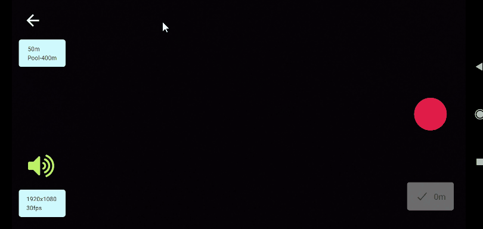
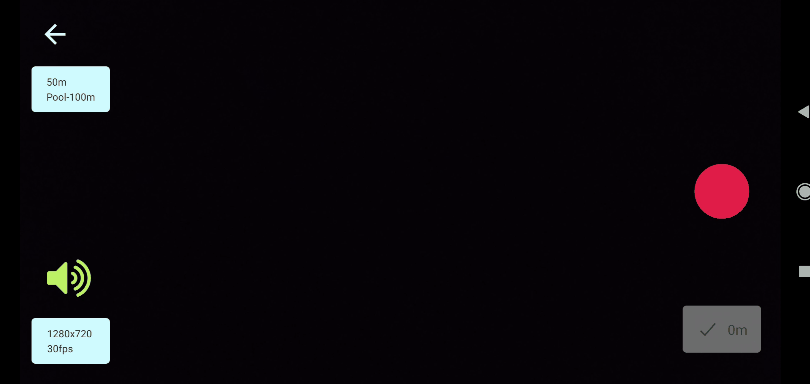
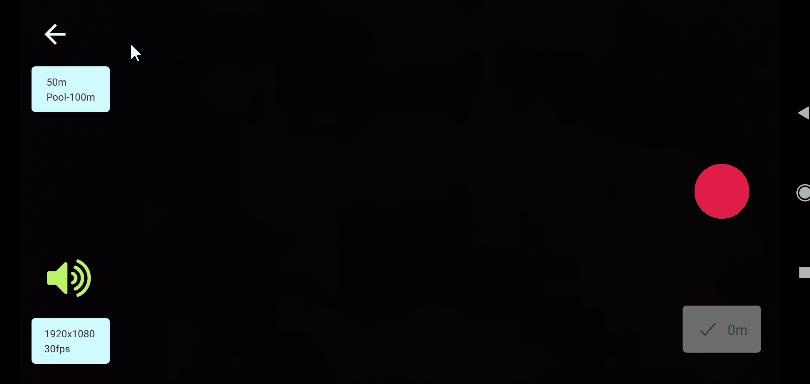
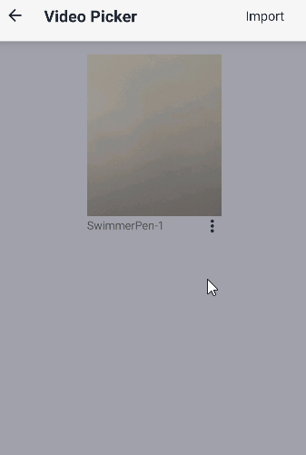
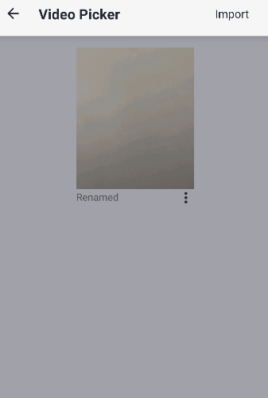
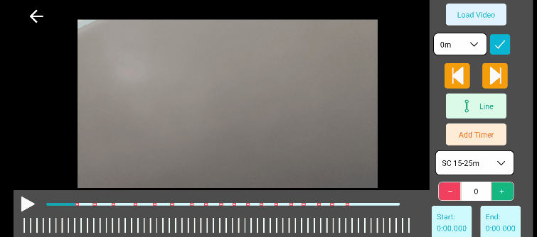
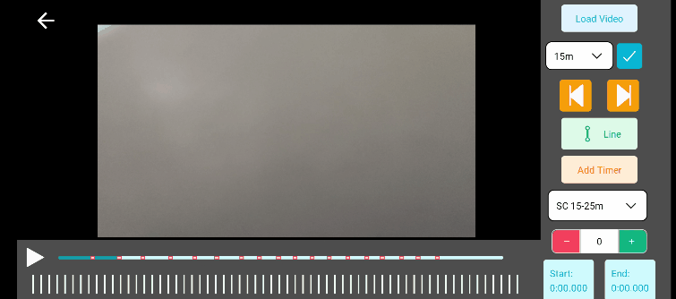
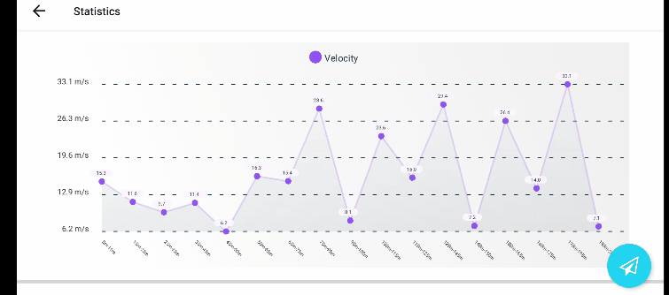

## SwimmerPen quick guide

## Contents
- [Camera](#camera)
  - [Changing resolution](#changing-resolution)
  - [Changing race distance](#changing-race-distance)
  - [Mute audio](#mute-audio)
  - [Recording and annotating](#recording-and-annotating)
  - [Zooming](#zooming-pinch-on-the-camera-screen)
- [Controls](#controls)
  - [Loading video](#loading-video)
  - [Importing files](#importing-files)
  - [Renaming video](#renaming-video)
  - [Delete video](#delete-video)
  - [Move and zoom video](#move-and-zoom-video)
  - [Jumping between checkpoints](#jumping-between-checkpoints)
  - [Modifying checkpoint time](#modifying-checkpoint-time)
  - [Jumping to the next frame and back](#jumping-to-the-next-frame-and-back)
  - [Using the line tool](#using-the-line-tool)
  - [Using the timer tool](#using-the-timer-tool)
  - [Adding stroke count](#adding-stroke-count)
  - [Generating statistics from annotations](#generating-statistics-from-annotations)
  - [Sharing and saving](#sharing-and-saving)
- [Annotation Examples](#annotation-examples)
  - [Setting 0m](#setting-0m)
  - [Annotating distance](#annotating-distance)
  - [Annotating stroke](#annotating-stroke)

### Camera

#### Changing resolution  

#### Changing race distance  

#### Mute audio

#### Recording and annotating  

#### Zooming: pinch on the camera screen
\
\
\
\
\

### Controls

#### Loading video  

#### Importing files

#### Renaming video  

#### Delete video  

#### Move and zoom video  

#### Jumping between checkpoints  

#### Modifying checkpoint time  

#### Jumping to the next frame and back  

#### Using the line tool  

#### Using the timer tool
You can have multiple timers on screen, and you can remove the timer by long pressing on them  

#### Adding stroke count
You need to add stroke count, start time and end time of the stroke  

#### Generating statistics from annotations
All the graphs will appear only when annotation of checkpoints and stroke counts are complete  

#### Sharing and saving
Sharing and saving can be done on the statistics screen  

### Annotation Examples

#### Setting 0m
Based on race time and estimating swimmer touching wall at end of race

#### Annotating distance
Using the center of lane tags

#### Annotating stroke
By using hand contact on water as reference

