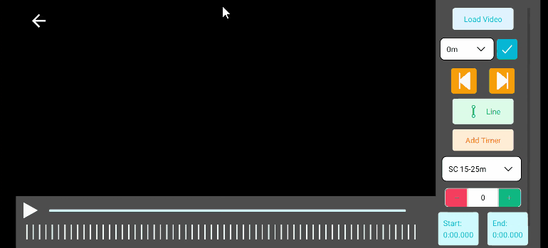

## SwimmerPen quick guide

### Camera

- Changing resolution  

- Changing race distance  

- Mute audio in recording  

- Recording and annotating  

- Zooming: pinch on the camera screen

### Annotating

- Loading video  

- Renaming video  

- Delete video  

- Move and zoom video  

- Jumping between checkpoints  

- Modifying checkpoint time  

- Jumping to the next frame and back  

- Using the line tool  

- Using the timer tool: you can have multiple timers on screen, and you can remove the timer by long pressing on them  

- Adding stroke count: you need to add stroke count, start time and end time of the stroke  

- Generating statistics from annotations: all the graphs will appear only when annotation of checkpoints and stroke counts are complete  

- Sharing/saving: Sharing and saving can be done on the statistics screen  

